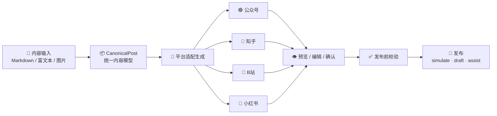
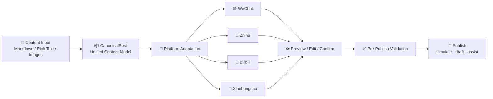

<p align="center">
  <picture>
    <source media="(prefers-color-scheme: dark)" srcset="https://readme-typing-svg.demolab.com?font=JetBrains+Mono&weight=700&size=36&duration=3000&pause=800&color=7CFFC4&center=true&vCenter=true&width=600&lines=flash-promoter;%E5%86%85%E5%AE%B9%E5%88%9B%E4%BD%9C%EF%BC%8C%E4%B8%80%E9%94%AE%E5%8F%91%E5%B8%83;%E5%A4%9A%E5%B9%B3%E5%8F%B0%E9%80%82%E9%85%8D%E5%B7%A5%E4%BD%9C%E5%8F%B0" />
    
  </picture>
</p>

<p align="center">
  <b>Write once, publish everywhere. 一次创作，全网分发。</b>
</p>

<p align="center">
  <a href="#-中文版"></a>
  <a href="#english"></a>
  <a href="https://github.com/voicepeak/Flash-promoter"></a>
  
  
  
  
  
</p>

---

<details open>
<summary><b>📖 中文版</b></summary>

## ✨ 概述

`flash-promoter` 是一个 **本地优先** 的跨平台内容发布工作台。你只需写一份源内容，它会自动为你生成适配微信公众号、知乎、B站、小红书四个平台的版本 —— 支持编辑、校验、模拟/草稿/辅助发布，并完整记录发布日志。

<br>



<br>

## 🎯 核心亮点

<table>
<tr>
<td width="50%">

### 🧠 统一内容模型
一个 `CanonicalPost` 承载所有原始内容：标题、正文块（段落/标题/图片/引用/代码/列表/分割线）、标签、封面和附件。写一次，到处适配。

### 🧩 插件化平台适配
`PlatformAdapter` 接口 + Registry 注册机制。每个平台独立封装 transform、validate、publish 三步，新增平台无需改动核心流程。

### 🛡️ 安全边界内置
- 默认不做真实发布
- AI 生成内容必须人工确认
- 辅助模式最终发布标记为 `manual-only`
- **不绕过** 登录、验证码、平台风控

</td>
<td width="50%">

### 📊 全流程可观测
SQLite 持久化存储，发布任务、日志、校验结果可追溯。右侧面板实时展示发布状态和时间线。

### 🎨 本地桌面工作台
React 编辑器 + 四平台独立预览标签页 + 一键验收按钮，5 分钟跑通完整 MVP 闭环。

### 📋 自动化验收
一条命令 `npm run test:acceptance` 启动临时 API，自动执行 10+ 验收步骤并打印 PASS/FAIL 结果。

</td>
</tr>
</table>

<br>

## 📊 平台适配矩阵

| 平台 | 适配器 | 默认模式 | 适配产物 |
|:---:|:---:|:---:|:---|
| 🧪 **Mock** | `mock.ts` | `simulate` | 完整模拟链路 |
| 🟢 **微信公众号** | `wechat.ts` | `draft` | 长文草稿 + 封面提示 |
| 🔵 **知乎** | `zhihuAssist.ts` | `assist` | 问答风格 + 话题标签 + 逻辑提示 |
| 🩷 **B站** | `bilibili.ts` | `simulate` | 专栏/视频标题 + 分区建议 + 置顶评论 |
| 🔴 **小红书** | `xhsAssist.ts` | `assist` | 笔记正文 + 话题标签 + 封面文字 + 卡片文案 |

<br>

## ⚡ 快速开始

### 环境要求

- **Node.js** >= 24
- **npm** >= 11

### 安装 & 启动

```bash
# 1. 安装依赖
npm install

# 2. 启动本地 API（终端 1）
npm run dev:api
# → http://127.0.0.1:3333

# 3. 启动桌面工作台（终端 2）
npm run dev:desktop
# → http://127.0.0.1:5173
```

### 使用流程

```text
载入示例内容 → 生成平台版本 → 编辑预览 → 确认版本 → 校验 → 发布
```

> [!TIP]
> 打开页面后点击「**一键跑通本地闭环**」，自动体验完整发布流程！

<br>

## 📁 项目结构

```
flash-promoter/
├── apps/
│   ├── desktop/            # React 桌面工作台 (Vite)
│   └── local-api/          # Fastify API 服务
├── packages/
│   ├── core/               # 核心模型 / 适配器 / 校验 / 生成
│   └── storage/            # SQLite 持久化层
├── docs/                   # 使用指南 / 测试指南 / PRD 验收
├── scripts/                # 自动化验收脚本
├── data/                   # 本地 SQLite 数据库
└── flash-promoter_prd.md   # 完整 PRD
```

<br>

## 🔧 可用命令

| 命令 | 说明 |
|:---|:---|
| `npm run dev:api` | 启动本地 API 服务器 |
| `npm run dev:desktop` | 启动桌面工作台 |
| `npm run build` | 构建全部 workspace |
| `npm run typecheck` | 类型检查 |
| `npm run test:acceptance` | 运行自动化验收测试 |

<br>

## 📋 功能清单

<table>
<tr><th>功能</th><th>状态</th><th>说明</th></tr>
<tr><td>Markdown / 富文本 / 纯文本输入</td><td align="center">✅</td><td>三类输入模式 + 图片拖拽上传</td></tr>
<tr><td>CanonicalPost 统一模型</td><td align="center">✅</td><td>7 种 Block 类型</td></tr>
<tr><td>四平台版本生成</td><td align="center">✅</td><td>公众号 / B站 / 知乎 / 小红书</td></tr>
<tr><td>平台版本编辑 & 确认</td><td align="center">✅</td><td>本地编辑 + 保存 + 确认门禁</td></tr>
<tr><td>发布前校验</td><td align="center">✅</td><td>通用 + 平台专项 MVP 检查</td></tr>
<tr><td>四模式发布</td><td align="center">✅</td><td>simulate / draft / assist / publish</td></tr>
<tr><td>SQLite 发布日志</td><td align="center">✅</td><td>Posts · Drafts · Jobs · Logs</td></tr>
<tr><td>自动化验收脚本</td><td align="center">✅</td><td>10+ 步骤端到端验证</td></tr>
<tr><td>真实平台发布</td><td align="center">🚧</td><td>MVP 阶段预留，需二次确认</td></tr>
<tr><td>Playwright 页面填充</td><td align="center">⏳</td><td>未来规划</td></tr>
</table>

<br>

## 📖 文档

- [用户指南](docs/USER_GUIDE.md) — 完整操作说明
- [测试指南](docs/TESTING.md) — 自动化 & 手动测试
- [PRD 验收](docs/PRD_ACCEPTANCE.md) — 需求对照追踪

<br>

## ❓ 常见问题

<details>
<summary><b>这个工具会真的发布到公众号/知乎/B站吗？</b></summary>
<br>
当前 MVP 阶段 <b>不会</b> 执行真实发布。所有操作在本地闭环完成，<code>publish</code> 模式预留了接口但需要二次确认才会开通。
</details>

<details>
<summary><b>和其他发布工具有什么区别？</b></summary>
<br>
flash-promoter 是 <b>本地优先 + 插件化适配</b> 的架构。你完全控制内容所在的设备，不依赖云服务。平台适配器以插件形式注册，新增平台不入侵核心流程。
</details>

<details>
<summary><b>需要平台账号吗？</b></summary>
<br>
模拟发布（simulate）不需要任何账号。草稿（draft）和辅助（assist）模式在 MVP 阶段也是全模拟的，不调用真实 API。
</details>

<br>

## 🗺️ 路线图

- [ ] 公众号真实草稿 API 接入
- [ ] B站真实投稿参数 API
- [ ] 小红书封面图/卡片图导出
- [ ] Playwright 浏览器自动化辅助
- [ ] Electron / Tauri 桌面打包
- [ ] 本地加密凭据存储
- [ ] 团队协作 & 排期发布

<br>

## 📈 Star History

<p align="center">
  <a href="https://star-history.com/#voicepeak/Flash-promoter&Date">
    <picture>
      <source media="(prefers-color-scheme: dark)" srcset="https://api.star-history.com/svg?repos=voicepeak/Flash-promoter&type=Date&theme=dark" />
      
    </picture>
  </a>
</p>

<br>

---

</details>

<h2 id="english">🌐 English</h2>

## ✨ Overview

`flash-promoter` is a **local-first** multi-platform content publishing workbench. Write one source post, and it auto-generates platform-adapted versions for WeChat Official Account, Zhihu, Bilibili, and Xiaohongshu — with editing, validation, simulated/draft/assist publishing, and full logging.

<br>



<br>

## 🎯 Key Highlights

| Feature | Description |
|:---|:---|
| 🧠 **Unified Content Model** | Single `CanonicalPost` with 7 block types (paragraph, heading, image, quote, code, list, divider) |
| 🧩 **Plugin Adapters** | `PlatformAdapter` interface + Registry. Add platforms without touching core logic |
| 🛡️ **Safety Boundary** | No real publishing by default. AI content requires human confirmation. Assist packages marked `manual-only` |
| 📊 **Observable Pipeline** | SQLite-backed jobs, logs, and validation. Real-time status in right panel |
| 🎨 **Desktop Workbench** | React editor with per-platform preview tabs and one-click acceptance run |
| 📋 **Auto Acceptance** | `npm run test:acceptance` — 10+ E2E steps in one command |

<br>

## ⚡ Quick Start

### Prerequisites

- **Node.js** >= 24
- **npm** >= 11

```bash
npm install

# Terminal 1 — Start API
npm run dev:api       # http://127.0.0.1:3333

# Terminal 2 — Start desktop
npm run dev:desktop    # http://127.0.0.1:5173
```

> [!TIP]
> Click 「**一键跑通本地闭环**」 to experience the full publish pipeline!

<br>

## 🔧 Commands

| Command | Description |
|:---|:---|
| `npm run dev:api` | Start local API server |
| `npm run dev:desktop` | Start desktop workbench |
| `npm run build` | Build all workspaces |
| `npm run typecheck` | Type check |
| `npm run test:acceptance` | Run acceptance tests |

<br>

## 📖 Docs

- [User Guide](docs/USER_GUIDE.md)
- [Testing Guide](docs/TESTING.md)
- [PRD Acceptance](docs/PRD_ACCEPTANCE.md)

<br>

## 🗺️ Roadmap

- [ ] Real WeChat draft API
- [ ] Real Bilibili submission API
- [ ] Xiaohongshu image asset export
- [ ] Playwright browser automation
- [ ] Electron / Tauri packaging
- [ ] Encrypted credential vault
- [ ] Team workflow & scheduling

<br>

<p align="center">
  <sub>Built with ❤️ for content creators who value control and efficiency.</sub>
</p>
