<p align="center">
  
</p>

<p align="center">
  
  
  
  
  
  
</p>

<p align="center">
  <a href="#zh">🇨🇳 中文</a> · <a href="#en">🇬🇧 英文</a>
</p>

---

<h1 align="center" id="zh">flash-promoter</h1>

<p align="center">
  本地优先的跨平台内容发布工作台 —— 一次创作，全网分发。
</p>

## 概述

面向内容创作者、自媒体运营和工具链验证场景。输入一份 Markdown 源内容，自动生成适配微信公众号、知乎、B站、小红书四个平台的版本，支持编辑、校验、模拟/草稿/辅助发布，全程不依赖云端服务。

## 语言边界

- 界面与文档默认使用中文；英文内容仅保留在独立英文文档区、代码标识、文件格式、接口路径和第三方产品名中。
- 用户可见的提示、按钮、表单、状态、错误和导出说明使用中文。

## 发布闭合管线

```text
Markdown 输入 → CanonicalPost 统一模型 → 4 平台适配生成 → 预览/编辑/确认 → 发布前校验 → 发布（simulate / draft / assist）
```

## 功能模块

| 模块 | 能力 |
|------|------|
| **输入** | Markdown / 富文本 / 纯文本三种模式，图片拖拽上传 |
| **统一模型** | `CanonicalPost` 承载 7 种 Block 类型（段落、标题、图片、引用、代码、列表、分割线） |
| **适配生成** | 插件化 `PlatformAdapter` + Registry 注册机制，新增平台不入侵核心流程 |
| **平台预览** | 四平台独立预览标签页，实时切换查看 |
| **编辑确认** | 分平台编辑标题、正文、标签和元数据，AI 生成内容须人工确认 |
| **发布校验** | 通用校验 + 平台专项 MVP 检查，含错误码和字段级提示 |
| **发布** | simulate（模拟）、draft（草稿）、assist（辅助，manual-only）、publish（真实发布，预留） |
| **日志** | SQLite 持久化，Posts · Drafts · Jobs · Logs · Assets 可追溯 |
| **验收** | `npm run test:acceptance` 一键跑通 10+ 步闭环验证 |

## 平台矩阵

| 平台 | 适配器 | 默认模式 | 适配产物 |
|:---:|:---:|:---:|:---|
| 公众号 | `wechat.ts` | `draft` | 长文草稿 + 封面提示 |
| 知乎 | `zhihuAssist.ts` | `assist` | 问答风格 + 话题标签 + 逻辑提示 |
| B站 | `bilibili.ts` | `simulate` | 专栏/视频标题 + 分区建议 + 置顶评论 |
| 小红书 | `xhsAssist.ts` | `assist` | 笔记正文 + 话题标签 + 封面文字 + 卡片文案 |
| Mock | `mock.ts` | `simulate` | 完整模拟链路（开发测试用） |

## 安全边界

- 默认不做真实发布
- AI 生成内容须人工确认后才能执行非 simulate 模式
- 辅助发布（assist）最终发布操作标记为 `manual-only`
- 不绕过登录、验证码或平台风控机制
- `publish` 模式须二次确认

## 快速开始

### 环境要求

- **Node.js** >= 24
- **npm** >= 11

### 安装 & 启动

```bash
npm install             # 安装依赖
npm run dev:api         # 终端 1：启动 API → http://127.0.0.1:3333
npm run dev:desktop     # 终端 2：启动桌面工作台 → http://127.0.0.1:5173
```

打开页面后点击「**一键跑通本地闭环**」或「**载入示例内容**」即可开始体验。

## 可用命令

| 命令 | 说明 |
|:---|:---|
| `npm run dev:api` | 启动本地 API 服务 |
| `npm run dev:desktop` | 启动桌面工作台 |
| `npm run build` | 构建全部 workspace |
| `npm run typecheck` | 类型检查 |
| `npm run test:acceptance` | 运行自动化验收测试 |

## 项目结构

```
flash-promoter/
├── apps/
│   ├── desktop/            # React 桌面工作台 (Vite)
│   └── local-api/          # Fastify API 服务
├── packages/
│   ├── core/               # 核心模型 / 适配器 / 校验 / 生成
│   └── storage/            # SQLite 持久化层
├── docs/                   # 文档 / 动态横幅 SVG
├── scripts/                # 自动化验收脚本
├── data/                   # 本地 SQLite 数据库
└── flash-promoter_prd.md   # 完整 PRD
```

## 文档

- [用户指南](docs/USER_GUIDE.md) — 完整操作说明
- [测试指南](docs/TESTING.md) — 自动化 & 手动测试
- [PRD 验收](docs/PRD_ACCEPTANCE.md) — 需求对照追踪

## 常见问题

<details>
<summary><b>会真的发布到公众号/知乎/B站吗？</b></summary>

当前 MVP 阶段**不会**执行真实发布。所有操作在本地闭环完成。`publish` 模式预留了接口但需二次确认才会开通。

</details>

<details>
<summary><b>和其他发布工具有什么区别？</b></summary>

本地优先 + 插件化适配架构。你完全控制内容所在的设备，不依赖云服务。平台适配器以插件形式注册，新增平台不入侵核心流程。

</details>

<details>
<summary><b>需要平台账号吗？</b></summary>

模拟发布（simulate）不需要任何账号。草稿（draft）和辅助（assist）模式在 MVP 阶段也是全模拟的，不调用真实 API。

</details>

## 路线图

- [ ] 公众号真实草稿 API 接入
- [ ] B站真实投稿参数 API
- [ ] 小红书封面图/卡片图导出
- [ ] Playwright 浏览器自动化辅助发布
- [ ] Electron / Tauri 桌面打包
- [ ] 本地加密凭据存储
- [ ] 团队协作 & 排期发布

## 协议

MIT

---

<h1 align="center" id="en">flash-promoter</h1>

<p align="center">
  Local-first multi-platform content publishing workbench — write once, publish everywhere.
</p>

## Overview

Built for content creators, social media operators, and toolchain validators. Input one Markdown source and auto-generate platform-adapted versions for WeChat Official Account, Zhihu, Bilibili, and Xiaohongshu — with editing, validation, and simulated/draft/assist publishing — all local, zero cloud dependency.

## Language Boundary

- UI and documentation default to Chinese; English content is kept only in the standalone English section, code identifiers, file formats, API paths, and third-party product names.
- User-facing prompts, buttons, forms, status messages, and errors use Chinese.

## Publish Pipeline

```text
Markdown Input → CanonicalPost (Unified Model) → 4-Platform Adaptation → Preview/Edit/Confirm → Validation → Publish (simulate / draft / assist)
```

## Features

| Module | Capabilities |
|--------|-------------|
| **Input** | Markdown, rich text, and plain text modes; drag-and-drop image upload |
| **Unified Model** | `CanonicalPost` with 7 block types (paragraph, heading, image, quote, code, list, divider) |
| **Adaptation** | Plugin-based `PlatformAdapter` + Registry — add platforms without touching core logic |
| **Preview** | Per-platform preview tabs with real-time switching |
| **Edit & Confirm** | Per-platform editing of title, body, tags, and metadata; AI-generated content requires human confirmation |
| **Validation** | Common + platform-specific checks, error codes, and field-level hints |
| **Publishing** | simulate · draft · assist (manual-only) · publish (reserved, gated) |
| **Logging** | SQLite-backed: Posts · Drafts · Jobs · Logs · Assets |
| **Acceptance** | `npm run test:acceptance` — 10+ E2E verification steps in one command |

## Platform Matrix

| Platform | Adapter | Default Mode | Output |
|:---:|:---:|:---:|:---|
| WeChat | `wechat.ts` | `draft` | Long-form draft + cover prompt |
| Zhihu | `zhihuAssist.ts` | `assist` | Q&A style + topics + logic hints |
| Bilibili | `bilibili.ts` | `simulate` | Article/video title + partition + pinned comment |
| Xiaohongshu | `xhsAssist.ts` | `assist` | Note body + hashtags + cover text + card copy |
| Mock | `mock.ts` | `simulate` | Full simulation pipeline (dev & test) |

## Safety Boundary

- No real publishing by default
- AI-generated content blocked from non-simulate modes until confirmed
- Assist packages marked `manual-only`
- No bypass of login, captcha, or platform risk controls
- `publish` mode requires second confirmation

## Quick Start

### Prerequisites

- **Node.js** >= 24
- **npm** >= 11

```bash
npm install             # Install dependencies
npm run dev:api         # Terminal 1: Start API → http://127.0.0.1:3333
npm run dev:desktop     # Terminal 2: Start desktop → http://127.0.0.1:5173
```

Click 「**一键跑通本地闭环**」 or 「**载入示例内容**」 to get started.

## Commands

| Command | Description |
|:---|:---|
| `npm run dev:api` | Start local API server |
| `npm run dev:desktop` | Start desktop workbench |
| `npm run build` | Build all workspaces |
| `npm run typecheck` | Type check |
| `npm run test:acceptance` | Run acceptance tests |

## Project Structure

```
flash-promoter/
├── apps/
│   ├── desktop/            # React desktop workbench (Vite)
│   └── local-api/          # Fastify API server
├── packages/
│   ├── core/               # Core models / adapters / validation / generation
│   └── storage/            # SQLite persistence layer
├── docs/                   # Documentation / animated hero SVG
├── scripts/                # Acceptance test script
├── data/                   # Local SQLite database
└── flash-promoter_prd.md   # Full PRD
```

## Docs

- [User Guide](docs/USER_GUIDE.md)
- [Testing Guide](docs/TESTING.md)
- [PRD Acceptance](docs/PRD_ACCEPTANCE.md)

## FAQ

<details>
<summary><b>Does it really publish to WeChat / Zhihu / Bilibili?</b></summary>

No. The current MVP does not perform real publishing. All operations complete locally. The `publish` mode is reserved and requires a second confirmation to activate.

</details>

<details>
<summary><b>How is this different from other publishing tools?</b></summary>

Local-first + plugin architecture. You control where your content lives — no cloud dependency. Platform adapters are registered as plugins; adding a platform never touches core logic.

</details>

<details>
<summary><b>Do I need platform accounts?</b></summary>

Simulate mode requires no accounts. Draft and assist modes in MVP are fully simulated — no real API calls.

</details>

## Roadmap

- [ ] Real WeChat draft API
- [ ] Real Bilibili submission API
- [ ] Xiaohongshu image/card export
- [ ] Playwright browser automation
- [ ] Electron / Tauri packaging
- [ ] Encrypted credential vault
- [ ] Team workflow & scheduling

## License

MIT
